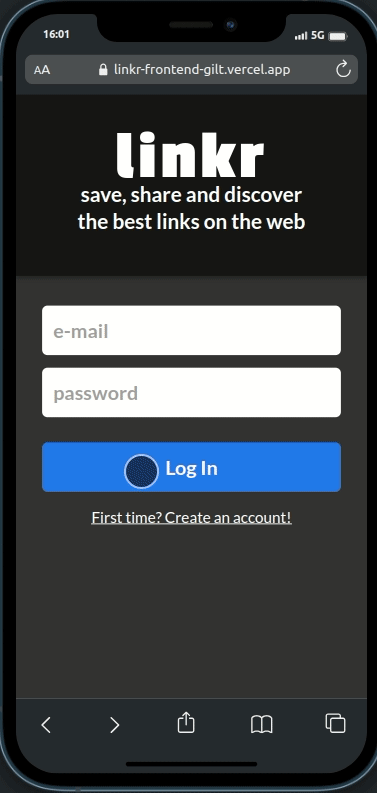

# Linkr (Frontend)

##### Neste repositório você encontrará a interface de usuário para a aplicação Linkr, uma plataforma de compartilhamento e descoberta de links. Este repositório contém o código-fonte do frontend do projeto.

<h2>Visão Geral</h2>

O Linkr é uma plataforma que permite aos usuários compartilhar e descobrir links interessantes. Com o frontend do Linkr, os usuários podem navegar pelos links compartilhados por outros usuários, adicionar seus próprios links e interagir com a comunidade, seguindo outros usuários, curtindo seus posts e comentando, além, é claro, de poder compartilhar suas publicações com sua própria rede.

<h2>Demo</h2>

Este projeto foi construído em colaboração com:

- [Diego Becker](https://github.com/DiegoBeker)
- [Felipe Iasbik](https://github.com/felipeiasbik)
- [Filipe Tenedini](https://github.com/FilipeTenedini)

<h2>Tecnologias Utilizadas</h2>

- **React:** O Linkr utiliza o framework React para criar a interface de usuário interativa.
- **Dayjs:** Para manipulação de datas e horas no projeto.
- **JWT:** O JSON Web Tokens é utilizado para autenticação e segurança.
- **Material-UI:** A biblioteca Material-UI é usada para componentes de interface de usuário.
- **Axios:** Para fazer requisições HTTP à API backend.
- **React Hooks:** Utilizado para gerenciar o estado e os efeitos no React.
- **React Hook Form:** Para criar e gerenciar formulários no projeto.

<h2>Principais recursos</h2>

- Registro e login de usuários.
- Página inicial com os links mais recentes.
- Trending, onde o usuário pode ver a lista de tags(#) mais populares.
- Feed personalizado, onde o usuário vê somente os posts dos usuários que segue.
- Pesquisa de usuários pelo nome.
- Adição e edição de links.
- Perfil de usuário com informações pessoais e links compartilhados.

<h2>Configuração</h2>

***Clonando o Repositório*** :
- Para começar, você deve clonar este repositório para o seu ambiente local. Use o seguinte comando no seu terminal:

`git clone https://github.com/seu-usuario/linkr-frontend.git`

***Instalando Dependências***:
- Navegue até o diretório do projeto e instale as dependências necessárias usando npm:

`cd linkr-frontend` e depois `npm install` ou `npm i`

***Configurando Variáveis de Ambiente***:

- Crie um arquivo `.env` como mostra o arquivo `.env.example`
- Este projeto foi desenvolvido como um projeto fullstack, portanto existe uma api própria para ele, o link para o repositório backend da aplicação é este: [Linkr Backend](https://github.com/csjhonathan/linkr_backend)

<h2>Execução</h2>

No seu terminal digite o comando `npm start` e o projeto estará disponível no link http://localhost:3000 , basta acessar a partir do seu navegador favorito.

**Para ver como ficou o projeto por completo e online, basta acessar o link abaixo**:

[Linkr](https://linkr-frontend-gilt.vercel.app)

Vale a ressalva de que o acesso pode ser um pouco lento devido ao backend estar hospedado em uma plataforma gratuita. Mas tenha paciência :)

Ademais,

### OBRIGADO PELA VISITA :D